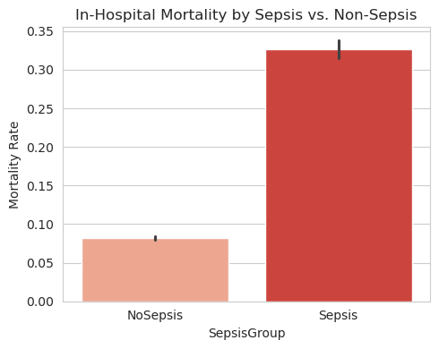

# Pulmonary and Sepsis Analysis

## Objective
The primary goal of this exploratory data analysis (EDA) is to investigate the relationship between pulmonary conditions and sepsis among hospital admissions. The study focuses on prevalence, co-occurrence, mortality rates, and length of stay for patients diagnosed with pulmonary conditions and sepsis.

---

## Key Findings

### General Statistics
- **Total Pulmonary Cases**: 5,311
- **Total Sepsis Cases**: 1,831
- **Cases with Both Conditions**: 94

### Proportional Analysis
- **Proportion of Pulmonary Admissions Developing Sepsis**: 15.26%
- **Proportion of Sepsis Admissions Developing Pulmonary Disease**: 44.43%

### Contingency Table
- **Neither Pulmonary Nor Sepsis**: 51,928 cases
- **Pulmonary Only**: 5,217 cases
- **Sepsis Only**: 1,737 cases
- **Both Conditions**: 94 cases

### Category Analysis
- **Category Distribution**:
  - **Neither**: 40,512 (68.7%)
  - **Respiratory Only**: 13,139 (22.3%)
  - **Sepsis Only**: 2,959 (5.0%)
  - **Respiratory + Sepsis**: 2,366 (4.0%)

---

## Mortality Analysis
### In-Hospital Mortality Rates
- **Pulmonary Group**: 15.11% vs. **Non-Pulmonary Group**: 8.92%
- **Sepsis Group**: 32.66% vs. **Non-Sepsis Group**: 8.21%
- **Category-Wise Mortality**:
  - **Neither**: 7.16%
  - **Respiratory Only**: 11.33%
  - **Sepsis Only**: 31.18%
  - **Respiratory + Sepsis**: 34.45%

---

## Length of Stay (LOS)
- **Pulmonary Group**: 5.9 days (mean) vs. Non-Pulmonary: 4.6 days
- **Sepsis Group**: 7.2 days (mean) vs. Non-Sepsis: 4.7 days
- **Category-Wise LOS**:
  - **Neither**: 4.2 days
  - **Respiratory Only**: 5.1 days
  - **Sepsis Only**: 8.8 days
  - **Respiratory + Sepsis**: 5.6 days

---

## Visualizations
### Contingency Table Heatmap

### Proportional Analysis

### Category Distribution

### Mortality Analysis
- **By Pulmonary Group**:
  
- **By Sepsis Group**:
  
- **By Category**:
  

### Length of Stay
- **Pulmonary Group**:
  
- **Sepsis Group**:
  
- **By Category**:
  

---

## Recommendations
1. **Targeted Interventions**: Focus on patients with both sepsis and pulmonary conditions due to higher mortality and longer LOS.
2. **Resource Allocation**: Allocate hospital resources to reduce LOS for high-risk groups.
3. **Further Research**: Investigate underlying factors contributing to the high co-occurrence rates and outcomes.

---

&copy; 2024 Sherry Hu. All Rights Reserved.
