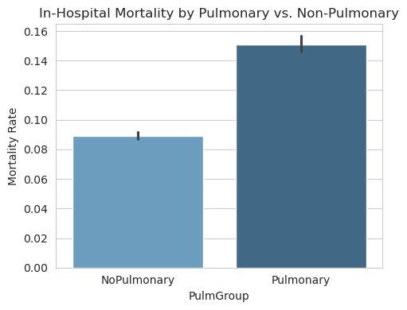

# Pulmonary and Sepsis Analysis

## Objective
The primary aim of this exploratory data analysis (EDA) is to investigate the relationship between pulmonary conditions and sepsis among hospital admissions. The analysis focuses on prevalence, co-occurrence, mortality rates, and length of stay for patients diagnosed with pulmonary conditions and sepsis. This report also evaluates and compares two approaches for identifying pulmonary and sepsis patients based on different data sources.

---

## Key Findings

### General Statistics
- **Pulmonary Patients**:
  - **Using Admission Diagnosis Column**: 5,311
  - **Using ICD-9 Codes**: 15,505
- **Sepsis Patients**:
  - **Using Admission Diagnosis Column**: 1,831
  - **Using ICD-9 Codes**: 5,325
- **Patients with Both Pulmonary and Sepsis**:
  - **Using Admission Diagnosis Column**: 94
  - **Using ICD-9 Codes**: 2,366

### Explanation of Methods
1. **Admission Diagnosis Column**:
   - This method flags pulmonary or sepsis cases based on keyword searches in the free-text admission diagnosis field. It provides a quick snapshot but may miss cases with less explicit terms or ambiguous wording.
   
2. **ICD-9 Codes**:
   - This method identifies pulmonary or sepsis cases using standardized diagnostic codes. It captures a broader range of cases and ensures consistency across records. However, it depends on accurate and complete coding in the hospital data.

The significant difference in patient counts between the two methods highlights the importance of complementary approaches in data analysis. Using both methods provides a more comprehensive understanding of the patient population.

---

### Contingency Table
- **Neither Pulmonary Nor Sepsis**: 
    - **Using ICD-9 Codes**: 40512 cases
    - **Using Admission Diagnosis Column**: 51,928 cases

- **Pulmonary Only**: 
    - **Using ICD-9 Codes**: 13139 cases
    - **Using Admission Diagnosis Column**: 5,217 cases
- **Sepsis Only**: 
    - **Using ICD-9 Codes**: 2959 cases
    - **Using Admission Diagnosis Column**: 1,737 cases
- **Both Pulmonary and Sepsis**: 
    - **Using ICD-9 Codes**: 2366 cases
    - **Using Admission Diagnosis Column**: 94 cases

## Proportional Analysis
- **Proportion of Pulmonary Admissions Developing Sepsis**: 
  - **Using ICD-9 Codes**: 15.26%
  - **Using Admission Diagnosis Column**: 1.77%
- **Proportion of Sepsis Admissions Developing Pulmonary Conditions**: 
  - **Using ICD-9 Codes**: 44.43%
  - **Using Admission Diagnosis Column**: 5.13%

---

## Mortality Analysis (Using ICD-9 Codes)
### In-Hospital Mortality Rates
- **Pulmonary Group**: 15.11% vs. **Non-Pulmonary Group**: 8.92%
- **Sepsis Group**: 32.66% vs. **Non-Sepsis Group**: 8.21%
- **Category-Wise Mortality**:
  - **Neither**: 7.16%
  - **Pulmonary Only**: 11.33%
  - **Sepsis Only**: 31.18%
  - **Pulmonary + Sepsis**: 34.45%

---

## Length of Stay (LOS) (Using ICD-9 Codes)
- **Pulmonary Group Mean**: 5.9 days vs. **Non-Pulmonary Group Mean**: 4.6 days
- **Sepsis Group Mean**: 7.2 days (mean) vs. **Non-Sepsis Group Mean**: 4.7 days
- **Category-Wise LOS** (Using ICD-9 Codes):
  - **Neither**: 4.2 days
  - **Pulmonary Only**: 5.1 days
  - **Sepsis Only**: 8.8 days
  - **Pulmonary + Sepsis**: 5.6 days

---

## Visualizations
### Contingency Table Heatmap

### Proportional Analysis

### Category Distribution

### Mortality Analysis
- **By Pulmonary Group**:
  
- **By Sepsis Group**:
  
- **By Category**:
  

### Length of Stay
- **Pulmonary Group**:
  
- **Sepsis Group**:
  
- **By Category**:
  

---

## Recommendations
1. **Leverage Dual Analysis Methods**: Utilize both admission diagnosis and ICD-9 code methods for comprehensive patient identification.
2. **Targeted Interventions**: Focus on patients with both sepsis and pulmonary conditions due to their higher mortality and longer LOS.
3. **Data Quality Improvement**: Ensure accurate and consistent ICD coding to improve the reliability of analyses.
4. **Resource Allocation**: Allocate hospital resources to reduce LOS for high-risk groups.
5. **Further Research**: Investigate factors contributing to the high co-occurrence rates and poor outcomes for pulmonary and sepsis patients.

---

&copy; 2024 Tongxun Hu. All Rights Reserved.
